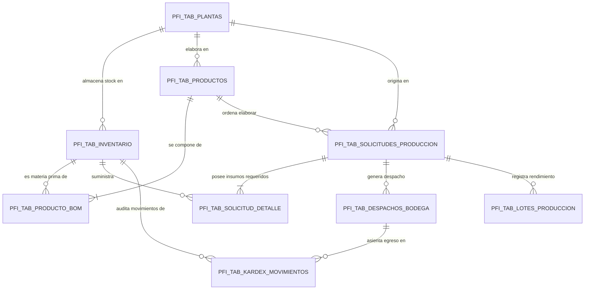
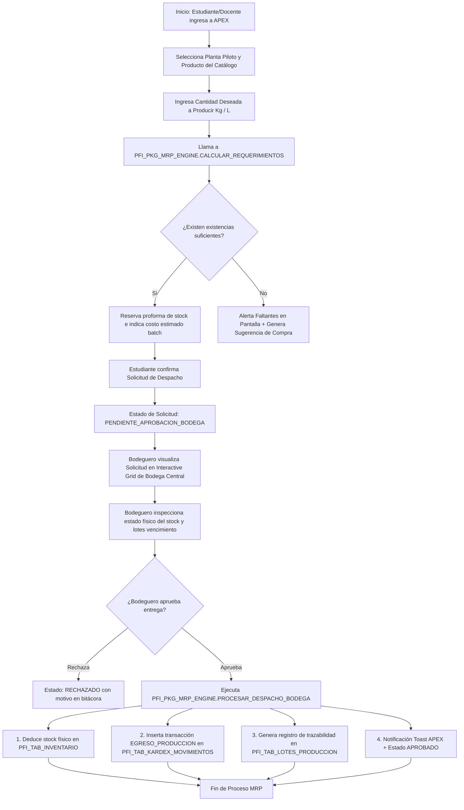

# ARQUITECTURA DEL SISTEMA MRP & MOTOR DINÁMICO DE FORMULACIÓN (BOM)
**Plataforma Target:** Oracle Database 19c / Oracle APEX 22.1 Universal Theme  
**Esquema:** `INV_PLANTA_FIACA`  
**Institución:** Universidad Politécnica Estatal del Carchi (FIACA - UPEC)

---

## 1. VISIÓN GENERAL DE LA ARQUITECTURA MRP INDUSTRIAL

El módulo **MRP (Material Requirements Planning)** y **BOM (Bill of Materials)** para las Plantas Piloto Universitarias transforma el prototipo estático en un **Sistema ERP Agroindustrial Escalable**.

```
                           ┌─────────────────────────────────────┐
                           │   PFI_TAB_PRODUCTOS (Fórmulas)      │
                           └──────────────────┬──────────────────┘
                                              │ 1:N
                           ┌──────────────────┴──────────────────┐
                           │    PFI_TAB_PRODUCTO_BOM (Reglas)     │
                           └──────────────────┬──────────────────┘
                                              │
 ┌────────────────────────┐                   ▼
 │ Estudiante / Docente   ├─────────► [Motor PL/SQL MRP]
 └────────────────────────┘                   │
   - Elige Producto                           ├────────► 1. Calcula Receta según Lote
   - Ingresa Kg o L a Producir                ├────────► 2. Convierte Unidades
                                              ├────────► 3. Evalúa Inventario Central
                                              ├────────► 4. Cuantifica Faltantes & Costos
                                              │
                                              ▼
                           ┌─────────────────────────────────────┐
                           │ PFI_TAB_SOLICITUDES_PRODUCCION      │
                           │ PFI_TAB_SOLICITUD_DETALLE           │
                           └──────────────────┬──────────────────┘
                                              │
 ┌────────────────────────┐                   ▼
 │ Bodeguero Central      ├─────────► [Confirmación Despacho]
 └────────────────────────┘                   │
                                              ├────────► A. Reduce Stock (PFI_TAB_INVENTARIO)
                                              ├────────► B. Genera Asiento Kardex (PFI_TAB_KARDEX)
                                              └────────► C. Crea Lote Producción (PFI_TAB_LOTES)
```

---

## 2. DIAGRAMA ENTIDAD-RELACIÓN (MERMAID ERD)



---

## 3. DIAGRAMA DE FLUJO DE PROCESO (BPM)



---

## 4. SCRIPT DDL COMPLETO (ORACLE DATABASE 19C)

```sql
-- =============================================================================
-- ESQUEMA: INV_PLANTA_FIACA - ARQUITECTURA DE TABLAS MRP / BOM Y KARDEX
-- UNIVERSIDAD POLITÉCNICA ESTATAL DEL CARCHI (ORACLE DATABASE 19C)
-- =============================================================================

PROMPT Eliminando tablas en orden inverso de dependencia...
DROP TABLE PFI_TAB_KARDEX_MOVIMIENTOS CASCADE CONSTRAINTS;
DROP TABLE PFI_TAB_LOTES_PRODUCCION CASCADE CONSTRAINTS;
DROP TABLE PFI_TAB_DESPACHOS_BODEGA CASCADE CONSTRAINTS;
DROP TABLE PFI_TAB_SOLICITUD_DETALLE CASCADE CONSTRAINTS;
DROP TABLE PFI_TAB_SOLICITUDES_PRODUCCION CASCADE CONSTRAINTS;
DROP TABLE PFI_TAB_PRODUCTO_BOM CASCADE CONSTRAINTS;
DROP TABLE PFI_TAB_PRODUCTOS CASCADE CONSTRAINTS;
DROP TABLE PFI_TAB_CONVERSIONES_UNIDAD CASCADE CONSTRAINTS;
DROP TABLE PFI_TAB_UNIDADES_MEDIDA CASCADE CONSTRAINTS;

-- -----------------------------------------------------------------------------
-- 1. CATÁLOGOS DE UNIDADES Y CONVERSIONES
-- -----------------------------------------------------------------------------
PROMPT Creando PFI_TAB_UNIDADES_MEDIDA...
CREATE TABLE PFI_TAB_UNIDADES_MEDIDA (
    CODIGO         VARCHAR2(20) NOT NULL,
    NOMBRE         VARCHAR2(100) NOT NULL,
    TIPO_UNIDAD    VARCHAR2(20) NOT NULL, -- MASA, VOLUMEN, UNIDAD
    CONSTRAINT PK_PFI_UNIDADES_MEDIDA PRIMARY KEY (CODIGO),
    CONSTRAINT CHK_PFI_UNID_TIPO CHECK (TIPO_UNIDAD IN ('MASA', 'VOLUMEN', 'UNIDAD'))
);

PROMPT Creando PFI_TAB_CONVERSIONES_UNIDAD...
CREATE TABLE PFI_TAB_CONVERSIONES_UNIDAD (
    CODIGO                 NUMBER GENERATED BY DEFAULT AS IDENTITY,
    UNIDAD_ORIGEN          VARCHAR2(20) NOT NULL,
    UNIDAD_DESTINO         VARCHAR2(20) NOT NULL,
    FACTOR_CONVERSION      NUMBER(18, 8) NOT NULL,
    CONSTRAINT PK_PFI_CONVERSIONES PRIMARY KEY (CODIGO),
    CONSTRAINT FK_PFI_CONV_ORIGEN FOREIGN KEY (UNIDAD_ORIGEN) REFERENCES PFI_TAB_UNIDADES_MEDIDA(CODIGO),
    CONSTRAINT FK_PFI_CONV_DESTINO FOREIGN KEY (UNIDAD_DESTINO) REFERENCES PFI_TAB_UNIDADES_MEDIDA(CODIGO),
    CONSTRAINT UQ_PFI_CONV_PAR UNIQUE (UNIDAD_ORIGEN, UNIDAD_DESTINO)
);

-- -----------------------------------------------------------------------------
-- 2. PRODUCTOS Y FÓRMULAS DINÁMICAS (BOM)
-- -----------------------------------------------------------------------------
PROMPT Creando PFI_TAB_PRODUCTOS...
CREATE TABLE PFI_TAB_PRODUCTOS (
    CODIGO                 NUMBER GENERATED BY DEFAULT AS IDENTITY,
    CODIGO_PLANTA          NUMBER NOT NULL,
    NOMBRE_PRODUCTO        VARCHAR2(250) NOT NULL,
    DESCRIPCION            VARCHAR2(1000),
    LOTE_BASE_ESTANDAR     NUMBER(12, 4) DEFAULT 1.0 NOT NULL,
    UNIDAD_MEDIDA_LOTE     VARCHAR2(20) NOT NULL,
    RENDIMIENTO_ESPERADO_PCT NUMBER(5, 2) DEFAULT 100.0 NOT NULL,
    ESTADO                 VARCHAR2(20) DEFAULT 'ACTIVO' NOT NULL,
    FECHA_CREACION         DATE DEFAULT SYSDATE NOT NULL,
    CONSTRAINT PK_PFI_PRODUCTOS PRIMARY KEY (CODIGO),
    CONSTRAINT FK_PFI_PRODUCTOS_PLANTA FOREIGN KEY (CODIGO_PLANTA) REFERENCES PFI_TAB_PLANTAS(CODIGO),
    CONSTRAINT FK_PFI_PRODUCTOS_UNID FOREIGN KEY (UNIDAD_MEDIDA_LOTE) REFERENCES PFI_TAB_UNIDADES_MEDIDA(CODIGO),
    CONSTRAINT CHK_PFI_PRODUCTOS_ESTADO CHECK (ESTADO IN ('ACTIVO', 'INACTIVO'))
);

PROMPT Creando PFI_TAB_PRODUCTO_BOM...
CREATE TABLE PFI_TAB_PRODUCTO_BOM (
    CODIGO                 NUMBER GENERATED BY DEFAULT AS IDENTITY,
    CODIGO_PRODUCTO        NUMBER NOT NULL,
    CODIGO_ITEM_INVENTARIO NUMBER NOT NULL,
    TIPO_REGLA_CALCULO     VARCHAR2(30) NOT NULL, 
    COEFICIENTE_VALOR      NUMBER(12, 4) NOT NULL,
    UNIDAD_MEDIDA_RECETA   VARCHAR2(20) NOT NULL,
    ORDEN_AGREGADO         NUMBER(3) DEFAULT 1 NOT NULL,
    ES_OPTATIVO            VARCHAR2(2) DEFAULT 'NO' NOT NULL,
    CONSTRAINT PK_PFI_PRODUCTO_BOM PRIMARY KEY (CODIGO),
    CONSTRAINT FK_PFI_BOM_PRODUCTO FOREIGN KEY (CODIGO_PRODUCTO) REFERENCES PFI_TAB_PRODUCTOS(CODIGO),
    CONSTRAINT FK_PFI_BOM_ITEM FOREIGN KEY (CODIGO_ITEM_INVENTARIO) REFERENCES PFI_TAB_INVENTARIO(CODIGO),
    CONSTRAINT FK_PFI_BOM_UNID FOREIGN KEY (UNIDAD_MEDIDA_RECETA) REFERENCES PFI_TAB_UNIDADES_MEDIDA(CODIGO),
    CONSTRAINT CHK_PFI_BOM_TIPO_REGLA CHECK (TIPO_REGLA_CALCULO IN (
        'BASE_MAESTRA', 
        'PCT_SOBRE_BASE', 
        'PCT_SOBRE_CARNICO', 
        'GRAMOS_POR_KG_TOTAL', 
        'CANTIDAD_FIJA',
        'PCT_SOBRE_VOLUMEN_LECHE'
    )),
    CONSTRAINT CHK_PFI_BOM_OPT CHECK (ES_OPTATIVO IN ('SI', 'NO'))
);

CREATE INDEX IX_PFI_BOM_PROD ON PFI_TAB_PRODUCTO_BOM(CODIGO_PRODUCTO);
CREATE INDEX IX_PFI_BOM_ITEM ON PFI_TAB_PRODUCTO_BOM(CODIGO_ITEM_INVENTARIO);

-- -----------------------------------------------------------------------------
-- 3. SOLICITUDES Y DETALLE MRP DE PRODUCCIÓN
-- -----------------------------------------------------------------------------
PROMPT Creando PFI_TAB_SOLICITUDES_PRODUCCION...
CREATE TABLE PFI_TAB_SOLICITUDES_PRODUCCION (
    CODIGO                 NUMBER GENERATED BY DEFAULT AS IDENTITY,
    NUMERO_SOLICITUD       VARCHAR2(50) NOT NULL,
    CODIGO_PLANTA          NUMBER NOT NULL,
    CODIGO_PRODUCTO        NUMBER NOT NULL,
    SOLICITANTE_NOMBRE     VARCHAR2(200) NOT NULL,
    ROLES_SOLICITANTE      VARCHAR2(50) DEFAULT 'ESTUDIANTE' NOT NULL,
    CANTIDAD_A_PRODUCIR    NUMBER(12, 4) NOT NULL,
    UNIDAD_MEDIDA_SOLICITADA VARCHAR2(20) NOT NULL,
    COSTO_ESTIMADO_TOTAL   NUMBER(12, 2) DEFAULT 0 NOT NULL,
    ESTADO_SOLICITUD       VARCHAR2(35) DEFAULT 'PENDIENTE' NOT NULL,
    FECHA_SOLICITUD        DATE DEFAULT SYSDATE NOT NULL,
    OBSERVACIONES_PRACTICA VARCHAR2(1000),
    CONSTRAINT PK_PFI_SOLICITUDES_PROD PRIMARY KEY (CODIGO),
    CONSTRAINT FK_PFI_SOLPROD_PLANTA FOREIGN KEY (CODIGO_PLANTA) REFERENCES PFI_TAB_PLANTAS(CODIGO),
    CONSTRAINT FK_PFI_SOLPROD_PRODUCTO FOREIGN KEY (CODIGO_PRODUCTO) REFERENCES PFI_TAB_PRODUCTOS(CODIGO),
    CONSTRAINT FK_PFI_SOLPROD_UNID FOREIGN KEY (UNIDAD_MEDIDA_SOLICITADA) REFERENCES PFI_TAB_UNIDADES_MEDIDA(CODIGO),
    CONSTRAINT UQ_PFI_SOLPROD_NUM UNIQUE (NUMERO_SOLICITUD),
    CONSTRAINT CHK_PFI_SOLPROD_ESTADO CHECK (ESTADO_SOLICITUD IN ('PENDIENTE', 'RESERVADO', 'APROBADO', 'RECHAZADO', 'CANCELADO'))
);

PROMPT Creando PFI_TAB_SOLICITUD_DETALLE...
CREATE TABLE PFI_TAB_SOLICITUD_DETALLE (
    CODIGO                 NUMBER GENERATED BY DEFAULT AS IDENTITY,
    CODIGO_SOLICITUD       NUMBER NOT NULL,
    CODIGO_ITEM_INVENTARIO NUMBER NOT NULL,
    CANTIDAD_REQUERIDA     NUMBER(12, 4) NOT NULL,
    UNIDAD_MEDIDA_REQUERIDA VARCHAR2(20) NOT NULL,
    STOCK_DISPONIBLE_MOMENTO NUMBER(12, 4) NOT NULL,
    CANTIDAD_FALTANTE      NUMBER(12, 4) DEFAULT 0 NOT NULL,
    PRECIO_UNITARIO_MOMENTO NUMBER(12, 4) DEFAULT 0 NOT NULL,
    SUBTOTAL_ESTIMADO      NUMBER(12, 2) DEFAULT 0 NOT NULL,
    ES_SUMINISTRADO        VARCHAR2(2) DEFAULT 'SI' NOT NULL,
    CONSTRAINT PK_PFI_SOLICITUD_DETALLE PRIMARY KEY (CODIGO),
    CONSTRAINT FK_PFI_SOLDET_SOLICITUD FOREIGN KEY (CODIGO_SOLICITUD) REFERENCES PFI_TAB_SOLICITUDES_PRODUCCION(CODIGO) ON DELETE CASCADE,
    CONSTRAINT FK_PFI_SOLDET_ITEM FOREIGN KEY (CODIGO_ITEM_INVENTARIO) REFERENCES PFI_TAB_INVENTARIO(CODIGO),
    CONSTRAINT FK_PFI_SOLDET_UNID FOREIGN KEY (UNIDAD_MEDIDA_REQUERIDA) REFERENCES PFI_TAB_UNIDADES_MEDIDA(CODIGO),
    CONSTRAINT CHK_PFI_SOLDET_SUM CHECK (ES_SUMINISTRADO IN ('SI', 'NO'))
);

CREATE INDEX IX_PFI_SOLDET_SOL ON PFI_TAB_SOLICITUD_DETALLE(CODIGO_SOLICITUD);

-- -----------------------------------------------------------------------------
-- 4. DESPACHOS, KARDEX Y TRACABILIDAD DE LOTES
-- -----------------------------------------------------------------------------
PROMPT Creando PFI_TAB_DESPACHOS_BODEGA...
CREATE TABLE PFI_TAB_DESPACHOS_BODEGA (
    CODIGO                 NUMBER GENERATED BY DEFAULT AS IDENTITY,
    CODIGO_SOLICITUD       NUMBER NOT NULL,
    BODEGUERO_RESPONSABLE  VARCHAR2(200) NOT NULL,
    FECHA_DESPACHO         DATE DEFAULT SYSDATE NOT NULL,
    MONTO_TOTAL_COBRADO    NUMBER(12, 2) NOT NULL,
    NOTAS_ENTREGA          VARCHAR2(1000),
    CONSTRAINT PK_PFI_DESPACHOS_BODEGA PRIMARY KEY (CODIGO),
    CONSTRAINT FK_PFI_DESPACHOS_SOL FOREIGN KEY (CODIGO_SOLICITUD) REFERENCES PFI_TAB_SOLICITUDES_PRODUCCION(CODIGO)
);

PROMPT Creando PFI_TAB_KARDEX_MOVIMIENTOS...
CREATE TABLE PFI_TAB_KARDEX_MOVIMIENTOS (
    CODIGO                 NUMBER GENERATED BY DEFAULT AS IDENTITY,
    CODIGO_ITEM_INVENTARIO NUMBER NOT NULL,
    TIPO_MOVIMIENTO        VARCHAR2(30) NOT NULL, -- INGRESO_COMPRA, EGRESO_PRODUCCION, AJUSTE_PERDIDA, RESERVA
    CODIGO_DESPACHO        NUMBER,
    CANTIDAD_MOVIMIENTO    NUMBER(12, 4) NOT NULL,
    UNIDAD_MEDIDA          VARCHAR2(20) NOT NULL,
    STOCK_ANTERIOR         NUMBER(12, 4) NOT NULL,
    STOCK_POSTERIOR        NUMBER(12, 4) NOT NULL,
    COSTO_UNITARIO         NUMBER(12, 4) DEFAULT 0 NOT NULL,
    COSTO_TOTAL_MOVIMIENTO NUMBER(12, 2) DEFAULT 0 NOT NULL,
    USUARIO_REGISTRO       VARCHAR2(100) DEFAULT USER NOT NULL,
    FECHA_MOVIMIENTO       DATE DEFAULT SYSDATE NOT NULL,
    CONSTRAINT PK_PFI_KARDEX PRIMARY KEY (CODIGO),
    CONSTRAINT FK_PFI_KARDEX_ITEM FOREIGN KEY (CODIGO_ITEM_INVENTARIO) REFERENCES PFI_TAB_INVENTARIO(CODIGO),
    CONSTRAINT FK_PFI_KARDEX_DESPACHO FOREIGN KEY (CODIGO_DESPACHO) REFERENCES PFI_TAB_DESPACHOS_BODEGA(CODIGO),
    CONSTRAINT CHK_PFI_KARDEX_TIPO CHECK (TIPO_MOVIMIENTO IN ('INGRESO_COMPRA', 'EGRESO_PRODUCCION', 'AJUSTE_PERDIDA', 'RESERVA'))
);

CREATE INDEX IX_PFI_KARDEX_ITEM ON PFI_TAB_KARDEX_MOVIMIENTOS(CODIGO_ITEM_INVENTARIO);

PROMPT Creando PFI_TAB_LOTES_PRODUCCION...
CREATE TABLE PFI_TAB_LOTES_PRODUCCION (
    CODIGO                 NUMBER GENERATED BY DEFAULT AS IDENTITY,
    NUMERO_LOTE_FABRICA    VARCHAR2(100) NOT NULL,
    CODIGO_SOLICITUD       NUMBER NOT NULL,
    CANTIDAD_PRODUCIDA_REAL NUMBER(12, 4) NOT NULL,
    UNIDAD_MEDIDA          VARCHAR2(20) NOT NULL,
    FECHA_ELABORACION      DATE DEFAULT SYSDATE NOT NULL,
    FECHA_EXPIRACION_LOTE  DATE,
    COSTO_TOTAL_LOTE       NUMBER(12, 2) NOT NULL,
    COSTO_UNITARIO_LOTE    NUMBER(12, 4) NOT NULL,
    RESPONSABLE_CONTROL_CALIDAD VARCHAR2(200),
    CONSTRAINT PK_PFI_LOTES PRIMARY KEY (CODIGO),
    CONSTRAINT FK_PFI_LOTES_SOL FOREIGN KEY (CODIGO_SOLICITUD) REFERENCES PFI_TAB_SOLICITUDES_PRODUCCION(CODIGO),
    CONSTRAINT UQ_PFI_LOTES_NUM UNIQUE (NUMERO_LOTE_FABRICA)
);
```

---

## 5. PACKAGE PL/SQL COMPLETO: `PFI_PKG_MRP_ENGINE`

```sql
CREATE OR REPLACE PACKAGE PFI_PKG_MRP_ENGINE AS
    -- =========================================================================
    -- MOTOR MRP Y BOM DINÁMICO DE PLANTAS PILOTO (FIACA - UPEC)
    -- =========================================================================
    
    -- Calcula dinámicamente el BOM sin importar el producto (Chorizo, Queso, Mermelada, etc.)
    PROCEDURE CALCULAR_REQUERIMIENTOS (
        p_codigo_producto     IN NUMBER,
        p_cantidad_producir   IN NUMBER,
        p_solicitante_nombre  IN VARCHAR2,
        p_rol_solicitante     IN VARCHAR2,
        p_observaciones       IN VARCHAR2,
        p_codigo_solicitud    OUT NUMBER,
        p_numero_solicitud    OUT VARCHAR2,
        p_costo_total_est     OUT NUMBER,
        p_hay_faltantes       OUT VARCHAR2
    );

    -- Procesa la aprobación y despacho físico de bodega, descontando inventario y asentando Kardex
    PROCEDURE PROCESAR_DESPACHO_BODEGA (
        p_codigo_solicitud    IN NUMBER,
        p_bodeguero_nombre    IN VARCHAR2,
        p_notas_entrega       IN VARCHAR2,
        p_codigo_despacho     OUT NUMBER,
        p_monto_cobrado       OUT NUMBER
    );

    -- Función auxiliar para conversión de unidades físicas
    FUNCTION CONVERTIR_CANTIDAD (
        p_cantidad      IN NUMBER,
        p_unidad_origen IN VARCHAR2,
        p_unidad_destino IN VARCHAR2
    ) RETURN NUMBER;
END PFI_PKG_MRP_ENGINE;
/

CREATE OR REPLACE PACKAGE BODY PFI_PKG_MRP_ENGINE AS

    FUNCTION CONVERTIR_CANTIDAD (
        p_cantidad      IN NUMBER,
        p_unidad_origen IN VARCHAR2,
        p_unidad_destino IN VARCHAR2
    ) RETURN NUMBER IS
        v_factor NUMBER;
    BEGIN
        IF p_unidad_origen = p_unidad_destino THEN
            RETURN p_cantidad;
        END IF;
        
        BEGIN
            SELECT FACTOR_CONVERSION
              INTO v_factor
              FROM PFI_TAB_CONVERSIONES_UNIDAD
             WHERE UNIDAD_ORIGEN = p_unidad_origen
               AND UNIDAD_DESTINO = p_unidad_destino;
        EXCEPTION
            WHEN NO_DATA_FOUND THEN
                -- Inverso
                SELECT (1 / FACTOR_CONVERSION)
                  INTO v_factor
                  FROM PFI_TAB_CONVERSIONES_UNIDAD
                 WHERE UNIDAD_ORIGEN = p_unidad_destino
                   AND UNIDAD_DESTINO = p_unidad_origen;
        END;
        
        RETURN p_cantidad * v_factor;
    EXCEPTION
        WHEN OTHERS THEN
            RETURN p_cantidad; -- Fallback si no existe regla
    END CONVERTIR_CANTIDAD;

    PROCEDURE CALCULAR_REQUERIMIENTOS (
        p_codigo_producto     IN NUMBER,
        p_cantidad_producir   IN NUMBER,
        p_solicitante_nombre  IN VARCHAR2,
        p_rol_solicitante     IN VARCHAR2,
        p_observaciones       IN VARCHAR2,
        p_codigo_solicitud    OUT NUMBER,
        p_numero_solicitud    OUT VARCHAR2,
        p_costo_total_est     OUT NUMBER,
        p_hay_faltantes       OUT VARCHAR2
    ) IS
        v_planta_prod        NUMBER;
        v_unid_prod          VARCHAR2(20);
        v_lote_base          NUMBER;
        v_factor_escalado    NUMBER;
        v_base_maestra_g     NUMBER := 0;
        v_peso_carnico_g     NUMBER := 0;
        v_volumen_leche_l    NUMBER := 0;
        v_cant_insumo_g      NUMBER;
        v_cant_convertida    NUMBER;
        v_stock_actual       NUMBER;
        v_faltante           NUMBER;
        v_precio_unit        NUMBER;
        v_subtotal           NUMBER;
        v_acumulado_costo    NUMBER := 0;
        v_sol_num            VARCHAR2(50);
        v_sol_id             NUMBER;
        v_faltantes_flag     BOOLEAN := FALSE;
    BEGIN
        -- 1. Obtener producto maestro
        SELECT CODIGO_PLANTA, UNIDAD_MEDIDA_LOTE, LOTE_BASE_ESTANDAR
          INTO v_planta_prod, v_unid_prod, v_lote_base
          FROM PFI_TAB_PRODUCTOS
         WHERE CODIGO = p_codigo_producto;
         
        v_factor_escalado := p_cantidad_producir / v_lote_base;
        v_sol_num := 'MRP-' || TO_CHAR(SYSDATE, 'YYYYMMDD') || '-' || LPAD(ROUND(DBMS_RANDOM.VALUE(100,999)), 4, '0');
        
        -- 2. Crear cabecera de solicitud
        INSERT INTO PFI_TAB_SOLICITUDES_PRODUCCION (
            NUMERO_SOLICITUD, CODIGO_PLANTA, CODIGO_PRODUCTO, SOLICITANTE_NOMBRE,
            ROLES_SOLICITANTE, CANTIDAD_A_PRODUCIR, UNIDAD_MEDIDA_SOLICITADA,
            COSTO_ESTIMADO_TOTAL, ESTADO_SOLICITUD, OBSERVACIONES_PRACTICA
        ) VALUES (
            v_sol_num, v_planta_prod, p_codigo_producto, p_solicitante_nombre,
            p_rol_solicitante, p_cantidad_producir, v_unid_prod,
            0, 'PENDIENTE', p_observaciones
        ) RETURNING CODIGO INTO v_sol_id;
        
        p_codigo_solicitud := v_sol_id;
        p_numero_solicitud := v_sol_num;

        -- 3. Primera pasada: Calcular BASE_MAESTRA si existe
        FOR r_base IN (
            SELECT COEFICIENTE_VALOR, TIPO_REGLA_CALCULO
              FROM PFI_TAB_PRODUCTO_BOM
             WHERE CODIGO_PRODUCTO = p_codigo_producto
               AND TIPO_REGLA_CALCULO IN ('BASE_MAESTRA', 'PCT_SOBRE_VOLUMEN_LECHE')
        ) LOOP
            IF r_base.TIPO_REGLA_CALCULO = 'BASE_MAESTRA' THEN
                v_base_maestra_g := r_base.COEFICIENTE_VALOR * v_factor_escalado;
            ELSIF r_base.TIPO_REGLA_CALCULO = 'PCT_SOBRE_VOLUMEN_LECHE' THEN
                v_volumen_leche_l := p_cantidad_producir; -- Asume litros base
            END IF;
        END LOOP;
        
        -- Calcular Masa Cárnica si existe grasa
        FOR r_grasa IN (
            SELECT COEFICIENTE_VALOR
              FROM PFI_TAB_PRODUCTO_BOM
             WHERE CODIGO_PRODUCTO = p_codigo_producto
               AND TIPO_REGLA_CALCULO = 'PCT_SOBRE_BASE'
        ) LOOP
            v_peso_carnico_g := v_base_maestra_g + (v_base_maestra_g * (r_grasa.COEFICIENTE_VALOR / 100));
        END LOOP;
        IF v_peso_carnico_g = 0 THEN v_peso_carnico_g := v_base_maestra_g; END IF;

        -- 4. Segunda pasada: Procesar cada insumo de la fórmula dinámica
        FOR b IN (
            SELECT b.CODIGO_ITEM_INVENTARIO, b.TIPO_REGLA_CALCULO, b.COEFICIENTE_VALOR,
                   b.UNIDAD_MEDIDA_RECETA, i.STOCK, i.UNIDAD_MEDIDA AS UNIDAD_BODEGA,
                   NVL(i.PRECIO_VENTA_SUGERIDO, NVL(i.COSTO_UNITARIO, 0)) AS PRECIO_UNIT
              FROM PFI_TAB_PRODUCTO_BOM b
              JOIN PFI_TAB_INVENTARIO i ON b.CODIGO_ITEM_INVENTARIO = i.CODIGO
             WHERE b.CODIGO_PRODUCTO = p_codigo_producto
             ORDER BY b.ORDEN_AGREGADO
        ) LOOP
            -- Determinar la cantidad en unidad de receta según la regla matemática
            IF b.TIPO_REGLA_CALCULO = 'BASE_MAESTRA' THEN
                v_cant_insumo_g := b.COEFICIENTE_VALOR * v_factor_escalado;
            ELSIF b.TIPO_REGLA_CALCULO = 'PCT_SOBRE_BASE' THEN
                v_cant_insumo_g := v_base_maestra_g * (b.COEFICIENTE_VALOR / 100);
            ELSIF b.TIPO_REGLA_CALCULO = 'PCT_SOBRE_CARNICO' THEN
                v_cant_insumo_g := v_peso_carnico_g * (b.COEFICIENTE_VALOR / 100);
            ELSIF b.TIPO_REGLA_CALCULO = 'GRAMOS_POR_KG_TOTAL' THEN
                v_cant_insumo_g := b.COEFICIENTE_VALOR * (p_cantidad_producir);
            ELSIF b.TIPO_REGLA_CALCULO = 'CANTIDAD_FIJA' THEN
                v_cant_insumo_g := b.COEFICIENTE_VALOR * v_factor_escalado;
            ELSIF b.TIPO_REGLA_CALCULO = 'PCT_SOBRE_VOLUMEN_LECHE' THEN
                v_cant_insumo_g := b.COEFICIENTE_VALOR * p_cantidad_producir;
            END IF;

            -- Convertir a la unidad de medida almacenada en Bodega Central
            v_cant_convertida := CONVERTIR_CANTIDAD(v_cant_insumo_g, b.UNIDAD_MEDIDA_RECETA, b.UNIDAD_BODEGA);
            v_stock_actual := b.STOCK;
            v_precio_unit := b.PRECIO_UNIT;
            v_subtotal := v_cant_convertida * v_precio_unit;
            v_acumulado_costo := v_acumulado_costo + v_subtotal;

            IF v_stock_actual < v_cant_convertida THEN
                v_faltante := v_cant_convertida - v_stock_actual;
                v_faltantes_flag := TRUE;
            ELSE
                v_faltante := 0;
            END IF;

            -- Insertar renglón de detalle MRP
            INSERT INTO PFI_TAB_SOLICITUD_DETALLE (
                CODIGO_SOLICITUD, CODIGO_ITEM_INVENTARIO, CANTIDAD_REQUERIDA,
                UNIDAD_MEDIDA_REQUERIDA, STOCK_DISPONIBLE_MOMENTO, CANTIDAD_FALTANTE,
                PRECIO_UNITARIO_MOMENTO, SUBTOTAL_ESTIMADO, ES_SUMINISTRADO
            ) VALUES (
                v_sol_id, b.CODIGO_ITEM_INVENTARIO, v_cant_convertida,
                b.UNIDAD_BODEGA, v_stock_actual, v_faltante,
                v_precio_unit, v_subtotal, 'SI'
            );
        END LOOP;

        -- 5. Actualizar total financiero en cabecera
        UPDATE PFI_TAB_SOLICITUDES_PRODUCCION
           SET COSTO_ESTIMADO_TOTAL = v_acumulado_costo
         WHERE CODIGO = v_sol_id;
         
        p_costo_total_est := v_acumulado_costo;
        p_hay_faltantes := CASE WHEN v_faltantes_flag THEN 'SI' ELSE 'NO' END;
    END CALCULAR_REQUERIMIENTOS;

    PROCEDURE PROCESAR_DESPACHO_BODEGA (
        p_codigo_solicitud    IN NUMBER,
        p_bodeguero_nombre    IN VARCHAR2,
        p_notas_entrega       IN VARCHAR2,
        p_codigo_despacho     OUT NUMBER,
        p_monto_cobrado       OUT NUMBER
    ) IS
        v_despacho_id NUMBER;
        v_total_monto NUMBER := 0;
        v_stock_ant   NUMBER;
        v_stock_post  NUMBER;
    BEGIN
        -- Sumar monto real suministrado
        SELECT NVL(SUM(SUBTOTAL_ESTIMADO), 0)
          INTO v_total_monto
          FROM PFI_TAB_SOLICITUD_DETALLE
         WHERE CODIGO_SOLICITUD = p_codigo_solicitud
           AND ES_SUMINISTRADO = 'SI';

        -- 1. Crear despacho
        INSERT INTO PFI_TAB_DESPACHOS_BODEGA (
            CODIGO_SOLICITUD, BODEGUERO_RESPONSABLE, FECHA_DESPACHO,
            MONTO_TOTAL_COBRADO, NOTAS_ENTREGA
        ) VALUES (
            p_codigo_solicitud, p_bodeguero_nombre, SYSDATE,
            v_total_monto, p_notas_entrega
        ) RETURNING CODIGO INTO v_despacho_id;
        
        p_codigo_despacho := v_despacho_id;
        p_monto_cobrado := v_total_monto;

        -- 2. Reducir stock e insertar en Kardex
        FOR d IN (
            SELECT CODIGO_ITEM_INVENTARIO, CANTIDAD_REQUERIDA, UNIDAD_MEDIDA_REQUERIDA, PRECIO_UNITARIO_MOMENTO
              FROM PFI_TAB_SOLICITUD_DETALLE
             WHERE CODIGO_SOLICITUD = p_codigo_solicitud
               AND ES_SUMINISTRADO = 'SI'
        ) LOOP
            SELECT STOCK INTO v_stock_ant
              FROM PFI_TAB_INVENTARIO
             WHERE CODIGO = d.CODIGO_ITEM_INVENTARIO FOR UPDATE;

            v_stock_post := GREATEST(0, v_stock_ant - d.CANTIDAD_REQUERIDA);

            UPDATE PFI_TAB_INVENTARIO
               SET STOCK = v_stock_post
             WHERE CODIGO = d.CODIGO_ITEM_INVENTARIO;

            INSERT INTO PFI_TAB_KARDEX_MOVIMIENTOS (
                CODIGO_ITEM_INVENTARIO, TIPO_MOVIMIENTO, CODIGO_DESPACHO,
                CANTIDAD_MOVIMIENTO, UNIDAD_MEDIDA, STOCK_ANTERIOR, STOCK_POSTERIOR,
                COSTO_UNITARIO, COSTO_TOTAL_MOVIMIENTO, USUARIO_REGISTRO
            ) VALUES (
                d.CODIGO_ITEM_INVENTARIO, 'EGRESO_PRODUCCION', v_despacho_id,
                d.CANTIDAD_REQUERIDA, d.UNIDAD_MEDIDA_REQUERIDA, v_stock_ant, v_stock_post,
                d.PRECIO_UNITARIO_MOMENTO, (d.CANTIDAD_REQUERIDA * d.PRECIO_UNITARIO_MOMENTO), p_bodeguero_nombre
            );
        END LOOP;

        -- 3. Marcar solicitud como APROBADO
        UPDATE PFI_TAB_SOLICITUDES_PRODUCCION
           SET ESTADO_SOLICITUD = 'APROBADO'
         WHERE CODIGO = p_codigo_solicitud;
    END PROCESAR_DESPACHO_BODEGA;

END PFI_PKG_MRP_ENGINE;
/
```

---

## 6. DATOS SEMILLA (DML): UNIDADES, FÓRMULA CHORIZO PICANTE Y QUESO FRESCO

```sql
-- 1. UNIDADES DE MEDIDA Y CONVERSIONES
INSERT INTO PFI_TAB_UNIDADES_MEDIDA VALUES ('g', 'Gramos', 'MASA');
INSERT INTO PFI_TAB_UNIDADES_MEDIDA VALUES ('Kg', 'Kilogramos', 'MASA');
INSERT INTO PFI_TAB_UNIDADES_MEDIDA VALUES ('ml', 'Mililitros', 'VOLUMEN');
INSERT INTO PFI_TAB_UNIDADES_MEDIDA VALUES ('L', 'Litros', 'VOLUMEN');
INSERT INTO PFI_TAB_UNIDADES_MEDIDA VALUES ('Unidades', 'Unidades Físicas', 'UNIDAD');

INSERT INTO PFI_TAB_CONVERSIONES_UNIDAD (UNIDAD_ORIGEN, UNIDAD_DESTINO, FACTOR_CONVERSION) VALUES ('g', 'Kg', 0.001);
INSERT INTO PFI_TAB_CONVERSIONES_UNIDAD (UNIDAD_ORIGEN, UNIDAD_DESTINO, FACTOR_CONVERSION) VALUES ('ml', 'L', 0.001);
INSERT INTO PFI_TAB_CONVERSIONES_UNIDAD (UNIDAD_ORIGEN, UNIDAD_DESTINO, FACTOR_CONVERSION) VALUES ('Kg', 'g', 1000);
INSERT INTO PFI_TAB_CONVERSIONES_UNIDAD (UNIDAD_ORIGEN, UNIDAD_DESTINO, FACTOR_CONVERSION) VALUES ('L', 'ml', 1000);

-- 2. PRODUCTO 1: CHORIZO PICANTE BARRICA DEL DIABLO (Planta Cárnicos, Lote Base 2.08 Kg)
INSERT INTO PFI_TAB_PRODUCTOS (CODIGO_PLANTA, NOMBRE_PRODUCTO, DESCRIPCION, LOTE_BASE_ESTANDAR, UNIDAD_MEDIDA_LOTE, RENDIMIENTO_ESPERADO_PCT)
VALUES (4, 'Chorizo Picante Barrica del Diablo', 'Embutido madurado ahumado artesanal', 2.08, 'Kg', 95.5);

-- BOM Chorizo Picante (Lote 2.08 Kg)
INSERT INTO PFI_TAB_PRODUCTO_BOM (CODIGO_PRODUCTO, CODIGO_ITEM_INVENTARIO, TIPO_REGLA_CALCULO, COEFICIENTE_VALOR, UNIDAD_MEDIDA_RECETA, ORDEN_AGREGADO)
VALUES (1, 107, 'BASE_MAESTRA', 1361.00, 'g', 1); -- Carne de Pollo
INSERT INTO PFI_TAB_PRODUCTO_BOM (CODIGO_PRODUCTO, CODIGO_ITEM_INVENTARIO, TIPO_REGLA_CALCULO, COEFICIENTE_VALOR, UNIDAD_MEDIDA_RECETA, ORDEN_AGREGADO)
VALUES (1, 108, 'PCT_SOBRE_BASE', 27.61, 'g', 2); -- Grasa de Cerdo (27.61% de Carne)
INSERT INTO PFI_TAB_PRODUCTO_BOM (CODIGO_PRODUCTO, CODIGO_ITEM_INVENTARIO, TIPO_REGLA_CALCULO, COEFICIENTE_VALOR, UNIDAD_MEDIDA_RECETA, ORDEN_AGREGADO)
VALUES (1, 109, 'PCT_SOBRE_CARNICO', 20.25, 'g', 3); -- Cerveza Barrica (20.25% sobre Carne+Grasa)
INSERT INTO PFI_TAB_PRODUCTO_BOM (CODIGO_PRODUCTO, CODIGO_ITEM_INVENTARIO, TIPO_REGLA_CALCULO, COEFICIENTE_VALOR, UNIDAD_MEDIDA_RECETA, ORDEN_AGREGADO)
VALUES (1, 110, 'GRAMOS_POR_KG_TOTAL', 0.30, 'g', 4); -- Tripolifosfato
INSERT INTO PFI_TAB_PRODUCTO_BOM (CODIGO_PRODUCTO, CODIGO_ITEM_INVENTARIO, TIPO_REGLA_CALCULO, COEFICIENTE_VALOR, UNIDAD_MEDIDA_RECETA, ORDEN_AGREGADO)
VALUES (1, 111, 'GRAMOS_POR_KG_TOTAL', 10.32, 'g', 5); -- Sal Común
INSERT INTO PFI_TAB_PRODUCTO_BOM (CODIGO_PRODUCTO, CODIGO_ITEM_INVENTARIO, TIPO_REGLA_CALCULO, COEFICIENTE_VALOR, UNIDAD_MEDIDA_RECETA, ORDEN_AGREGADO)
VALUES (1, 112, 'GRAMOS_POR_KG_TOTAL', 0.74, 'g', 6); -- Sal de Cura

-- 3. PRODUCTO 2: QUESO FRESCO PASTEURIZADO (Planta Lácteos, Lote Base 10.00 Litros de Leche)
INSERT INTO PFI_TAB_PRODUCTOS (CODIGO_PLANTA, NOMBRE_PRODUCTO, DESCRIPCION, LOTE_BASE_ESTANDAR, UNIDAD_MEDIDA_LOTE, RENDIMIENTO_ESPERADO_PCT)
VALUES (5, 'Queso Fresco Pasteurizado UPEC', 'Queso fresco no madurado de leche entera', 10.00, 'L', 12.0); -- Rendimiento 12% (~1.2 Kg por cada 10L)

-- BOM Queso Fresco
-- Supongamos items en inventario: INV-122 (Leche Entera), INV-123 (Cloruro de Calcio), INV-124 (Cuajo Líquido), INV-125 (Sal para Queso)
INSERT INTO PFI_TAB_INVENTARIO (CODIGO_PLANTA, CATEGORIA, NOMBRE, STOCK, UNIDAD_MEDIDA, FECHA_VENCIMIENTO, COSTO_UNITARIO, PRECIO_VENTA_SUGERIDO)
VALUES (5, 'Insumo', 'Leche Cruda Entera de Vaca', 500.00, 'L', SYSDATE+2, 0.45, 0.55);
INSERT INTO PFI_TAB_INVENTARIO (CODIGO_PLANTA, CATEGORIA, NOMBRE, STOCK, UNIDAD_MEDIDA, FECHA_VENCIMIENTO, COSTO_UNITARIO, PRECIO_VENTA_SUGERIDO)
VALUES (5, 'Insumo', 'Cloruro de Calcio Grado Alimenticio', 5.00, 'Kg', SYSDATE+365, 12.00, 15.00);
INSERT INTO PFI_TAB_INVENTARIO (CODIGO_PLANTA, CATEGORIA, NOMBRE, STOCK, UNIDAD_MEDIDA, FECHA_VENCIMIENTO, COSTO_UNITARIO, PRECIO_VENTA_SUGERIDO)
VALUES (5, 'Insumo', 'Cuajo Líquido Fuerza 1:10000', 2000.00, 'ml', SYSDATE+180, 0.02, 0.03);

-- Reglas del Queso Fresco (por cada Litro de Leche):
-- Leche: 1.0 Litro Base
-- Cloruro de Calcio: 0.2 g por Litro de Leche
-- Cuajo Líquido: 1.5 ml por Litro de Leche
-- Sal Común: 12.0 g por Kg de Queso Obtenido
INSERT INTO PFI_TAB_PRODUCTO_BOM (CODIGO_PRODUCTO, CODIGO_ITEM_INVENTARIO, TIPO_REGLA_CALCULO, COEFICIENTE_VALOR, UNIDAD_MEDIDA_RECETA, ORDEN_AGREGADO)
VALUES (2, 122, 'CANTIDAD_FIJA', 10.00, 'L', 1); -- 10 Litros de Leche por lote base
INSERT INTO PFI_TAB_PRODUCTO_BOM (CODIGO_PRODUCTO, CODIGO_ITEM_INVENTARIO, TIPO_REGLA_CALCULO, COEFICIENTE_VALOR, UNIDAD_MEDIDA_RECETA, ORDEN_AGREGADO)
VALUES (2, 123, 'PCT_SOBRE_VOLUMEN_LECHE', 0.20, 'g', 2); -- 0.20 g/L de Leche -> 2.0g para 10L
INSERT INTO PFI_TAB_PRODUCTO_BOM (CODIGO_PRODUCTO, CODIGO_ITEM_INVENTARIO, TIPO_REGLA_CALCULO, COEFICIENTE_VALOR, UNIDAD_MEDIDA_RECETA, ORDEN_AGREGADO)
VALUES (2, 124, 'PCT_SOBRE_VOLUMEN_LECHE', 1.50, 'ml', 3); -- 1.5 ml/L de Leche -> 15.0 ml para 10L
INSERT INTO PFI_TAB_PRODUCTO_BOM (CODIGO_PRODUCTO, CODIGO_ITEM_INVENTARIO, TIPO_REGLA_CALCULO, COEFICIENTE_VALOR, UNIDAD_MEDIDA_RECETA, ORDEN_AGREGADO)
VALUES (2, 111, 'GRAMOS_POR_KG_TOTAL', 12.00, 'g', 4); -- Sal común en el queso
```

---

## 7. DISEÑO UX EN ORACLE APEX 22.1 UNIVERSAL THEME

### A. Página 1: Formulación Reactiva & Generación MRP (Estudiante / Docente)
* **Componente:** Master-Detail Form + Interactive Grid (`PFI_TAB_SOLICITUD_DETALLE`).
* **Dynamic Action 1 (On Change del Producto):**
  * **Event:** Change on `P_PRODUCTO_ID`.
  * **Action:** PL/SQL Code -> Ejecuta `PFI_PKG_MRP_ENGINE.CALCULAR_REQUERIMIENTOS(...)` y refresca el Interactive Grid sin recargar la página.
* **Faceted Search Integrado:** Permite filtrar productos por Planta Piloto (Cárnicos, Lácteos, Cereales).

### B. Página 2: Centro de Aprobación de Despachos (Bodega Central)
* **Componente:** Cards Region + Interactive Report.
* **Cards Region:** Muestra solicitudes pendientes en tarjetas destacadas en color `#FFD45B` (UPEC Yellow) con contador de faltantes en rojo.
* **Botonera Directa:** Botón "Ver e Inspeccionar Insumos" abre Modal Dialog (`Page 5`) para seleccionar lotes físicos antes del egreso.

### C. Página 3: Reporte de Kardex e Historial de Lotes de Producción
* **Componente:** APEX Interactive Report con descarga nativa en Excel y PDF.
* **Columns:** `NUMERO_SOLICITUD`, `PRODUCTO`, `CANTIDAD_PRODUCIDA_REAL`, `COSTO_TOTAL`, `FECHA_EXPIRACION`.

---

## 8. MATRIZ DE CONTROL DE ACCESO BASADO EN ROLES (RBAC)

| Rol APEX | Permisos en Formulación (BOM) | Permisos en Solicitudes MRP | Permisos en Despacho Bodega | Auditoría Kardex |
| :--- | :--- | :--- | :--- | :--- |
| **ADMINISTRADOR** | Crear / Modificar Recetas y Reglas | Consultar Todas | Supervisión General | Acceso Total |
| **DOCENTE** | Crear Recetas de Cátedra | Aprobar Solicitudes Estudiantes | Lectura de Costos | Consultar Kardex |
| **ESTUDIANTE** | Solo Lectura de Recetas | Generar Solicitud de Lote | Ninguno | Ninguno |
| **BODEGUERO** | Solo Lectura de BOM | Consultar Pendientes | **Confirmar / Despachar / Kardex** | Asentar Kardex |

---

## 9. VENTAJAS DE LA ARQUITECTURA PROPUESTA

1. **Escalabilidad Total:** Agregar un nuevo producto (ej. *Néctar de Guayaba* o *Cerveza Artesanal*) requiere únicamente insertar un registro en `PFI_TAB_PRODUCTOS` y sus líneas en `PFI_TAB_PRODUCTO_BOM`. **Cero modificación de código.**
2. **Cumplimiento Agroindustrial:** Soporta reglas complejas de ingeniería de alimentos (porcentajes sobre masa cárnica, aditivos por litro de leche pasteurizada y sal sobre masa total).
3. **Control Financiero Integrado:** Asienta el costo de materias primas consumidas y actualiza el kardex central en tiempo real.
